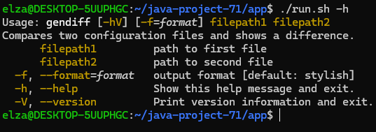
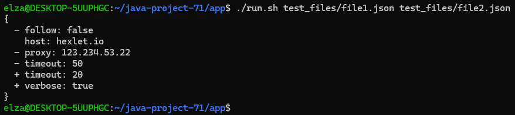
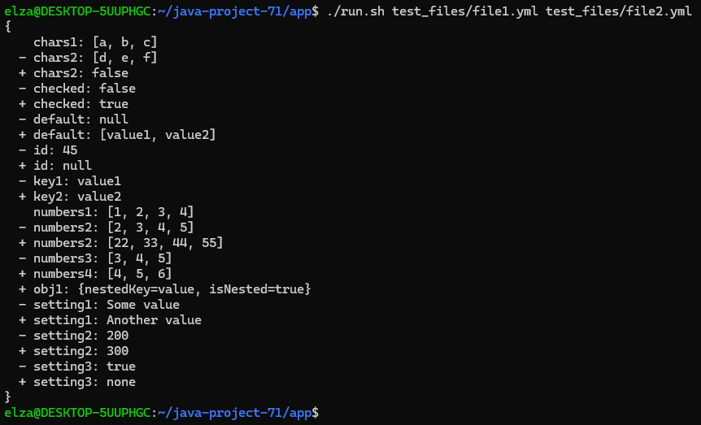
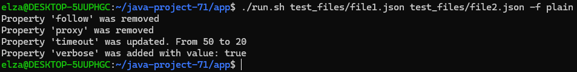

### Hexlet tests and linter status:

# Gendiff

Программа для сравнения файлов и вывода различий в удобочитаемом виде.

## Запуск и входные аргументы программы

Для удобства предоставлен run.sh скрипт вызывающий собранное приложение в `./build/install/app/bin/app` с аргументами

| Аргументы        | Описание                                                          |
|------------------|-------------------------------------------------------------------|
| `filepath1`      | Путь к первому файлу                                              |
| `filepath2`      | Путь ко второму файлу                                             |
| `-f`, `--format` | Формат вывода программы. Возможные варианты: json, stylish, plain |
| `-h`, `--help`   | вызов помощи программы                                            |

## Примеры запуска

Пример вывода помощи

Пример сравнения двух json файлов (с дефолтным stylish форматом вывода)

Пример сравнения двух yml файлов (с дефолтным stylish форматом вывода)

Пример сравнения двух файлов с выбранным форматом вывода результата

